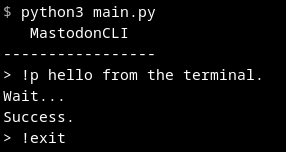

# MastodonCLI

Post to Mastodon instance from the terminal.



## Setup

```console
$export DOMAIN=<domain_name>
$export TOKEN=<token>
```

`<domain_name>` refers to *instance name* such as `mastodon.social`  
`<token>` refers to `access token`.

If you don't know your access token. Create one by following [these
steps.](#get-access-token)


## Run

```console
$python3 main.py
```

## Docs

To post some text. Use ```!p``` command.

```console
> !p hello from the terminal.
Wait...
Success.
```

The text "hello from the terminal." will be posted on the Mastodon instance.

To exit.

```console
> !exit
```


## Get access token

- Go the [settings/applications](https://mastodon.social/settings/applications).
- Click on **New application**.
- Give a name and click **submit**.
- Open newly created application.
- You can access you access token from here.
